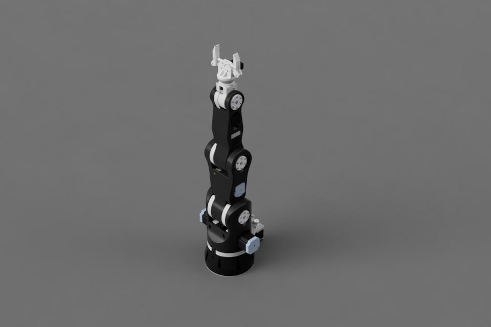
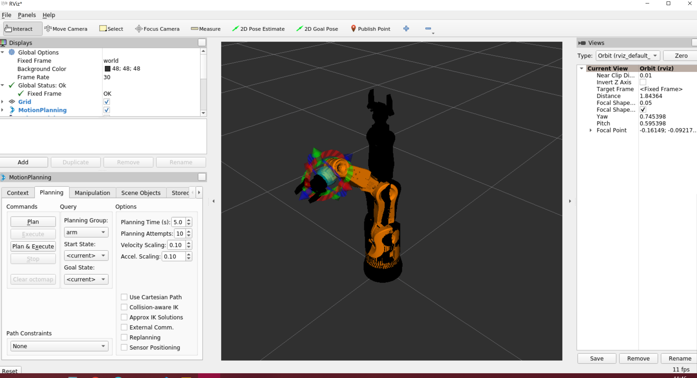
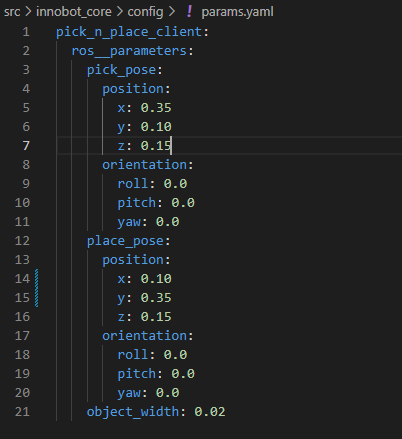

<div align="center">

# INNOBOT

Visit [INNOBOT Home page][def_inobot_homepage]


ROS 2 Foxy | 3D printed | open-source | designed for learning




</div>

# Get Started 

## Setup 

To setup your environment follow instructions on [INNOBOT Tutorials](https://www.innobot.eu/docs/tutorials/start)

## Pick and Place in RViz




1. Clone this repository 
2. `cd` into clonned repository
3. If you haven't got ROS 2 Foxy on your machine setup ROS 2 Foxy on your Ubuntu 20.04 machine by executing the helper script 
```bash
./ros-setup.sh
```
4. Build using 
```bash
colcon build
``` 
5. Source setup file
```bash
source install/setup.bash
```
6. tart the launch files using the helper script 
```bash
./ros2innobot.bash 
```
7. Set the position of the object in respect to the robots base in 
```bash
nano src/innobot_core/config/params.yaml
```

<div align="center">



</div>

8. Call the PnP client

    1. open new terminal 
    2. `cd` into clonned repository
    3. Source setup file
    ```bash
    source install/setup.bash
    ```
    4. Call PnP client
    ```bash
    ros2 run innobot_core pnp_client.py --ros-args --params-file src/innobot_core/config/params.yaml
    ```
    5. Watch the PnP execution in RViz 

<div align="center">


</div>

## Pick and Place with real hardware

TODO


[def_inobot_homepage]: https://www.innobot.eu
